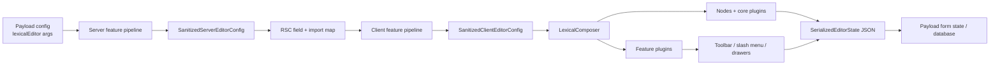
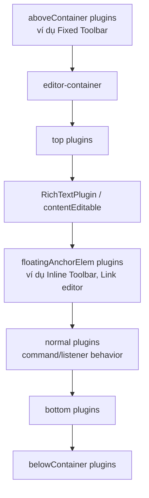
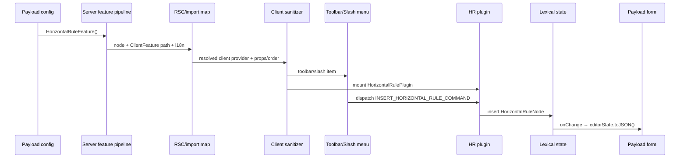

# Phân tích kiến trúc `@payloadcms/richtext-lexical`

> Phạm vi: package `packages/richtext-lexical`, phiên bản hiện tại `4.0.0-canary.14`, dùng Lexical `0.48.0`.
>
> Mục tiêu: giải thích kiến trúc dự án, các design pattern được áp dụng, cách dùng Lexical để tạo rich text, và đặc biệt là luồng từ cấu hình Payload đến UI trong Admin Panel.

## Mục lục

- [1. Kết luận nhanh](#1-kết-luận-nhanh)
- [2. Bản đồ kiến trúc](#2-bản-đồ-kiến-trúc)
- [3. Mô hình dữ liệu và cách Lexical vận hành](#3-mô-hình-dữ-liệu-và-cách-lexical-vận-hành)
- [4. Luồng từ config đến cấu hình server](#4-luồng-từ-config-đến-cấu-hình-server)
- [5. Cầu nối server → client](#5-cầu-nối-server--client)
- [6. Luồng client: từ feature đến UI](#6-luồng-client-từ-feature-đến-ui)
- [7. Cấu hình tạo nên toolbar và slash menu như thế nào?](#7-cấu-hình-tạo-nên-toolbar-và-slash-menu-như-thế-nào)
- [8. Case study: Horizontal Rule từ config đến database](#8-case-study-horizontal-rule-từ-config-đến-database)
- [9. Đồng bộ với Payload form và backend lifecycle](#9-đồng-bộ-với-payload-form-và-backend-lifecycle)
- [10. Serialization và render frontend](#10-serialization-và-render-frontend)
- [11. Các design pattern được áp dụng](#11-các-design-pattern-được-áp-dụng)
- [12. Cách sử dụng để tạo rich text](#12-cách-sử-dụng-để-tạo-rich-text)
- [13. Cách tạo custom feature](#13-cách-tạo-custom-feature)
- [14. Views: cùng dữ liệu, nhiều UI](#14-views-cùng-dữ-liệu-nhiều-ui)
- [15. Điểm mạnh, trade-off và lưu ý kỹ thuật](#15-điểm-mạnh-trade-off-và-lưu-ý-kỹ-thuật)
- [16. Thứ tự đọc source đề xuất](#16-thứ-tự-đọc-source-đề-xuất)
- [17. Mô hình tinh thần nên dùng khi mở rộng](#17-mô-hình-tinh-thần-nên-dùng-khi-mở-rộng)

## 1. Kết luận nhanh

Đây không chỉ là một React wrapper quanh Lexical. Package đóng vai trò **adapter hai phía server/client** giữa Payload và Lexical:

- Phía server đọc `lexicalEditor({...})`, dựng graph/thứ tự dependency giữa các feature, đăng ký node/hook/validation/i18n/schema/import map và tạo cấu hình đã được chuẩn hóa. Loader hiện có sai lệch giữa contract và thứ tự runtime; xem mục 4.4.
- React Server Component của field dùng import map để biến mô tả component dạng chuỗi thành các client feature thực tế.
- Phía client chạy lại bước khởi tạo feature, sau đó gom tất cả đóng góp thành một cấu hình duy nhất gồm `nodes`, `plugins`, `providers`, `enabledFormats`, `toolbarFixed`, `toolbarInline`, `slashMenu` và `markdownTransformers`.
- `LexicalComposer` nhận editor state JSON, theme và danh sách node; `LexicalEditor` lắp các plugin lõi cùng plugin do feature cung cấp.
- Mỗi thay đổi của editor được serialize thành `SerializedEditorState` và ghi trở lại Payload form state.

Ý tưởng kiến trúc trung tâm là:

> **Feature khai báo khả năng; sanitizer gom khả năng; renderer biến cấu hình đã gom thành UI.**



## 2. Bản đồ kiến trúc

### 2.1. Các lớp chính

| Lớp | Trách nhiệm | File tiêu biểu |
| --- | --- | --- |
| Public API / facade | Cung cấp các entry point ổn định cho server, client, React và converter | `src/index.ts`, `src/exports/**`, `package.json` |
| Payload adapter | Biến `lexicalEditor()` thành `RichTextAdapter` mà Payload hiểu | `src/index.ts` |
| Server feature system | Resolve feature, dependency, node hook, schema, i18n, validation | `src/features/typesServer.ts`, `src/lexical/config/server/**` |
| Server-client bridge | Sinh import map/schema map và resolve client component tại RSC | `src/utilities/generateImportMap.tsx`, `src/utilities/generateSchemaMap.ts`, `src/field/rscEntry.tsx` |
| Client feature system | Gom node, plugin, toolbar, slash menu, provider, format | `src/features/typesClient.ts`, `src/lexical/config/client/**` |
| Editor runtime | Tạo `LexicalComposer`, content editable, history, onChange và plugin | `src/lexical/LexicalProvider.tsx`, `src/lexical/LexicalEditor.tsx` |
| Feature modules | Đóng gói một capability xuyên suốt server/client | `src/features/**` |
| Payload field integration | Đồng bộ editor với form state, validation UI, read-only, views | `src/field/**` |
| Serialization / conversion | JSON ↔ HTML/JSX/Markdown/plain text | `src/features/converters/**`, `src/exports/{html,html-async,react,plaintext}` |
| Backend lifecycle | Field hooks, node hooks, populate REST/GraphQL, JSON Schema | `src/hooks.ts`, `src/populateGraphQL/**`, `src/validate/**`, `src/types/schema.ts` |
| Lexical compatibility facade | Re-export Lexical theo phiên bản package đã khóa | `src/lexical-proxy/**` |

### 2.2. Cách chia module

`src/features` là phần lớn nhất của package. Mỗi feature thường có cấu trúc tương tự:

```text
feature-name/
├── server/
│   ├── index.ts              # Server feature, public entry point
│   ├── nodes/                # Node dùng cho headless/server
│   ├── schema.ts             # Kiểu serialized + JSON Schema
│   ├── validate.ts           # Node validation nếu có
│   └── i18n.ts
├── client/
│   ├── index.tsx             # Client feature
│   ├── nodes/                # Node dùng trong browser/editor
│   └── plugins/              # Command/listener/drawer/UI behavior
└── markdownTransformer.ts    # Transformer dùng chung nếu phù hợp
```

Không phải feature nào cũng cần đầy đủ các phần trên:

- `BoldFeature` chủ yếu đóng góp text format, toolbar item và Markdown transformer.
- `ParagraphFeature` đóng góp toolbar/slash menu action nhưng dùng `ParagraphNode` có sẵn của Lexical.
- `HorizontalRuleFeature` có server node, client node, command, plugin, toolbar item và slash-menu item.
- `BlocksFeature`, `LinkFeature`, `RelationshipFeature` còn tích hợp schema con, validation, hook và population của Payload.
- `InlineToolbarFeature` và `FixedToolbarFeature` chủ yếu cung cấp **renderer plugin** cho các toolbar group do feature khác đóng góp.

### 2.3. Public entry points và ranh giới bundle

`package.json` tách API theo môi trường:

- `@payloadcms/richtext-lexical`: cấu hình server, official feature, type, headless utilities.
- `@payloadcms/richtext-lexical/client`: client feature, UI utilities và client node.
- `@payloadcms/richtext-lexical/react`: render JSON thành React/JSX.
- `@payloadcms/richtext-lexical/html`: chuyển JSON thành HTML đồng bộ.
- `@payloadcms/richtext-lexical/html-async`: chuyển HTML có population bất đồng bộ.
- `@payloadcms/richtext-lexical/plaintext`: chuyển JSON thành plain text.
- `@payloadcms/richtext-lexical/rsc`: các server component dùng bởi Payload Admin.
- `@payloadcms/richtext-lexical/lexical/**`: facade cho các package Lexical.

`bundle.js` bundle client entry riêng, giữ các dependency lớn ở dạng external và gom CSS thành `bundled.css`. Việc tách entry point ngăn server code lọt vào browser bundle và ngược lại.

Đối với code ứng dụng, nên import Lexical qua các path proxy của package, ví dụ:

```ts
import { createCommand } from '@payloadcms/richtext-lexical/lexical'
import { useLexicalComposerContext } from '@payloadcms/richtext-lexical/lexical/react/LexicalComposerContext'
```

Điều này giữ phiên bản Lexical của ứng dụng đồng bộ với phiên bản mà adapter hỗ trợ.

## 3. Mô hình dữ liệu và cách Lexical vận hành

### 3.1. Dữ liệu chuẩn là JSON, không phải HTML

Giá trị được lưu có dạng `SerializedEditorState`:

```json
{
  "root": {
    "type": "root",
    "children": [
      {
        "type": "paragraph",
        "children": [
          {
            "type": "text",
            "text": "Xin chào",
            "format": 0,
            "detail": 0,
            "mode": "normal",
            "style": "",
            "version": 1
          }
        ],
        "direction": "ltr",
        "format": "",
        "indent": 0,
        "textFormat": 0,
        "textStyle": "",
        "version": 1
      }
    ],
    "direction": "ltr",
    "format": "",
    "indent": 0,
    "version": 1
  }
}
```

HTML, JSX, Markdown và plain text chỉ là các **projection** được tạo từ JSON này. Đây là quyết định quan trọng vì:

- Editor không phụ thuộc vào markup frontend.
- Node custom có thể mang structured data, relationship hoặc block fields.
- Có thể render cùng dữ liệu theo nhiều giao diện khác nhau.
- Hooks, validation và population có thể chạy theo từng `node.type`.

### 3.2. Node là đơn vị mở rộng

Một Lexical node chịu trách nhiệm cho vòng đời dữ liệu của chính nó:

- `getType()`: discriminator ổn định trong JSON.
- `importJSON()`: JSON → node runtime.
- `exportJSON()`: node runtime → JSON lưu trữ.
- `importDOM()`: DOM ngoài → node, thường dùng khi paste/import HTML.
- `exportDOM()`: node → DOM, thường dùng khi copy/export kiểu Lexical.
- `createDOM()`: phần tử DOM bên ngoài trong editor.
- `decorate()`: nội dung React cho `DecoratorNode`.
- `updateDOM()`: cho Lexical biết có cần thay DOM khi node thay đổi hay không.

Package yêu cầu mỗi `node.type` chỉ do một feature đăng ký. `sanitizeServerFeatures()` kiểm tra trùng node type và throw error nếu vi phạm.

### 3.3. Read/update transaction

Lexical tách thao tác đọc và ghi:

```ts
editor.getEditorState().read(() => {
  // Đọc selection/node snapshot hiện tại
})

editor.update(() => {
  // Thay đổi selection hoặc node tree
})
```

Các helper có tiền tố `$`, ví dụ `$getSelection()` hoặc `$createParagraphNode()`, phải được gọi trong lexical read/update context phù hợp.

### 3.4. Commands, listeners và transforms

Package dùng ba cơ chế Lexical chính:

- **Command**: gửi intent như format bold hoặc insert horizontal rule.
- **Listener**: phản ứng với update, focus, blur hoặc selection.
- **Node transform**: cưỡng chế invariant của document, ví dụ loại bỏ format không được bật hoặc đổi heading không hợp lệ sang heading thấp nhất được cho phép.

Feature thường dùng React plugin không render UI (`return null`) để đăng ký các behavior này bằng `useEffect` và hủy đăng ký khi unmount.

## 4. Luồng từ config đến cấu hình server

### 4.1. Entry point `lexicalEditor()`

Entry point nằm ở `src/index.ts`:

```ts
editor: lexicalEditor({
  admin: { /* tùy biến field UI */ },
  features: ({ defaultFeatures, rootFeatures }) => [/* ... */],
  lexical: { /* namespace, theme... */ },
  views: './views#postViews',
})
```

`lexicalEditor()` chưa tạo React editor ngay. Nó trả về một `LexicalRichTextAdapterProvider`. Payload gọi provider này trong quá trình sanitize config với:

- `config`: Payload config đã sanitize.
- `isRoot`: editor đang là editor gốc hay editor override tại field.
- `parentIsLocalized`: thông tin localization từ field cha.

Adapter trả lại các capability mà Payload cần: `FieldComponent`, `CellComponent`, `DiffComponent`, `editorConfig`, `generateImportMap`, `generateSchemaMap`, hooks, validation, GraphQL population và JSON Schema.

Đây là điểm tích hợp chính giữa hai hệ thống.

### 4.2. Chọn danh sách feature

`featuresInputToEditorConfig()` trong `src/utilities/editorConfigFactory.ts` hỗ trợ ba trường hợp:

1. Không truyền `features`: dùng `defaultEditorFeatures`.
2. Truyền array: array đó **thay thế toàn bộ** default features.
3. Truyền callback: callback nhận `defaultFeatures` và `rootFeatures`, sau đó trả về array cuối cùng.

Ví dụ an toàn khi chỉ muốn thêm fixed toolbar:

```ts
lexicalEditor({
  features: ({ defaultFeatures }) => [
    ...defaultFeatures,
    FixedToolbarFeature(),
  ],
})
```

Nếu viết như sau thì editor chỉ còn đúng hai feature, không còn paragraph, heading, format, link... mặc định:

```ts
lexicalEditor({
  features: [FixedToolbarFeature(), RelationshipFeature()],
})
```

### 4.3. Default features

`src/lexical/config/server/default.ts` bật mặc định:

- Bold, italic, underline, strikethrough.
- Subscript, superscript, inline code.
- Paragraph, heading.
- Align, indent.
- Unordered list, ordered list, checklist.
- Link, relationship.
- Blockquote, upload, horizontal rule.
- Inline toolbar.

Các feature đáng chú ý **không nằm trong default** gồm Fixed Toolbar, Blocks, Table, Text State và các Debug feature.

Lexical config mặc định có namespace `lexical` và `LexicalEditorTheme`.

### 4.4. Resolve dependency: contract và hành vi hiện tại

`loadFeatures()` trong `src/lexical/config/server/loader.ts` thực hiện các bước chính:

1. Loại feature trùng key; **lần xuất hiện cuối cùng thắng** và giữ vị trí của lần cuối.
2. Tạo dependency graph từ `dependenciesPriority`, `dependencies` và `dependenciesSoft`.
3. Chạy DFS để tính thứ tự feature.
4. Kiểm tra dependency bắt buộc trong lúc resolve.
5. Gọi factory của từng feature với Payload config, feature map và các feature đã resolve.
6. Gắn `key`, `order`, dependency metadata rồi lưu vào `ResolvedServerFeatureMap`.

Contract của ba loại dependency được hiểu như sau:

| Loại | Contract |
| --- | --- |
| `dependenciesPriority` | Dependency phải tồn tại, phải resolve trước feature hiện tại và có thể được đọc từ `resolvedFeatures`. |
| `dependencies` | Dependency phải tồn tại; validation hiện chỉ bảo đảm sự hiện diện, không bảo đảm nó đã có trong `resolvedFeatures`. |
| `dependenciesSoft` | Dependency là tùy chọn; loader chỉ xét nó nếu feature tương ứng tồn tại. |

Tuy nhiên, implementation hiện tại **không thực thi đầy đủ contract trên**:

- DFS đẩy dependency vào `stack` trước dependent nhưng sau đó trả về `stack.reverse()`. Với quan hệ đơn giản `A` phụ thuộc `B`, thứ tự cuối là `A, B`, tức dependent đứng trước dependency.
- `dependencies` chỉ được kiểm tra trong `featureProviderMap`; loader không kiểm tra dependency đã resolve trước khi factory của dependent chạy.
- `dependenciesPriority` bắt buộc dependency đã có trong `resolvedFeatures`. Kết hợp với thứ tự bị đảo, graph priority đơn giản có thể ném lỗi “not loaded before it”.
- Cycle detection dùng `currentPath`, nhưng node được đánh dấu `visited` trước khi duyệt cạnh và recursive call chỉ xảy ra với node chưa visited. Vì vậy direct cycle, indirect cycle và self-cycle đều có thể bị bỏ qua.

Các built-in hiện không khai báo `dependenciesPriority`; dependency feature-level đáng chú ý là soft dependency `bold -> italic`, dùng để chỉ thêm transformer bold+italic khi italic được bật. Vì vậy luồng mặc định chưa bị ảnh hưởng rõ rệt, nhưng custom feature **không nên giả định dependency đã resolve và đọc nó từ `resolvedFeatures`** cho đến khi loader được sửa và có test cho order/cycle.

### 4.5. Sanitize server features

`sanitizeServerFeatures()` flatten toàn bộ resolved feature thành các registry dùng ở runtime:

```text
ResolvedServerFeatureMap
├── enabledFeatures[]
├── nodes[]
├── markdownTransformers[]
├── hooks.{beforeValidate,beforeChange,afterRead,afterChange}[]
├── nodeHooks.<phase>: Map<nodeType, hooks[]>
├── validations: Map<nodeType, validations[]>
├── graphQLPopulationPromises: Map<nodeType, functions[]>
├── getSubFields: Map<nodeType, fn>
├── getSubFieldsData: Map<nodeType, fn>
└── i18n
```

Kết quả là `SanitizedServerEditorConfig`, gồm:

- `features`: capability server đã flatten.
- `lexical`: Lexical editor config do caller truyền, có thể là `undefined`.
- `resolvedFeatureMap`: metadata đầy đủ theo từng feature.

`featuresInputToEditorConfig()` có dùng `defaultEditorConfig.lexical` làm fallback khi dựng `unSanitizedEditorConfig`, nhưng object trả về lại gán `lexical: args.lexical`. Đây là chủ ý trong type để không gửi default lexical config sang client khi caller không tùy biến nó. Tại client, `RichTextFieldImpl` mới áp dụng `defaultEditorLexicalConfig`; vì vậy **client sanitized config sau fallback** luôn có namespace/theme cần thiết, còn server sanitized config không nhất thiết có trường `lexical`.

## 5. Cầu nối server → client

Server không gửi thẳng function hoặc React component tùy ý qua RSC boundary. Package dùng **Payload component path + import map**.

### 5.1. Sinh import map

`getGenerateImportMap()` thêm:

- Field, cell và diff RSC entry.
- View map nếu có.
- `ClientFeature` của từng server feature.
- Các `componentImports` mà feature khai báo.
- Component của sub-field trong block/link nếu node có `getSubFields()`.

Ví dụ server feature khai báo:

```ts
ClientFeature: '@payloadcms/richtext-lexical/client#HorizontalRuleFeatureClient'
```

Payload import map sẽ biết cách resolve chuỗi này thành module/export thật.

### 5.2. Sinh schema map

`getGenerateSchemaMap()` gọi `generateSchemaMap()` của từng feature và namespace kết quả theo:

```text
<fieldSchemaPath>.lexical_internal_feature.<featureKey>.<schemaKey>
```

Cơ chế này cho phép node như block hoặc link chứa Payload field thật: relationship, upload, array, localized field, custom component, validation...

### 5.3. RSC field chuẩn bị props

`RscEntryLexicalField` trong `src/field/rscEntry.tsx`:

1. Nhận `SanitizedServerEditorConfig` từ adapter.
2. Gọi `initLexicalFeatures()`.
3. Resolve từng `ClientFeature` qua Payload import map.
4. Gắn `featureKey`, server order và client props.
5. Lọc schema map theo từng feature.
6. Xây initial form state cho nested block/inline-block fields.
7. Translate placeholder trên server.
8. Resolve view map nếu có.
9. Render client component `<RichTextField ... />`.

Kết quả gửi sang client chủ yếu là dữ liệu serializable cộng các component đã được Payload import map quản lý.

## 6. Luồng client: từ feature đến UI

### 6.1. Resolve client feature

`RichTextFieldImpl` trong `src/field/index.tsx` chạy sau hydration:

1. Chọn view hiện tại.
2. Áp dụng `view.filterFeatures()` nếu có.
3. Gọi từng `clientFeatureProvider(clientFeatureProps)`.
4. `loadClientFeatures()` resolve feature theo order đã tính từ server.
5. `sanitizeClientEditorConfig()` gom mọi đóng góp thành cấu hình client cuối.

Client không tự resolve dependency graph; nó sort provider theo `order` do server gán rồi sanitize contribution. Vì vậy client kế thừa cả thứ tự quan sát được từ loader server, bao gồm giới hạn nêu ở mục 4.4.

### 6.2. Sanitize client features

`sanitizeClientFeatures()` tạo:

```text
SanitizedClientFeatures
├── enabledFeatures[]
├── enabledFormats[]
├── nodes[]
├── plugins[]
├── providers[]
├── markdownTransformers[]
├── slashMenu.groups[]
├── slashMenu.dynamicGroups[]
├── toolbarFixed.groups[]
└── toolbarInline.groups[]
```

Các group cùng `key` được merge và item được nối vào cùng group. Với `toolbarInline` và `toolbarFixed`, group và item sau đó được sort theo `order`; comparator hiện dùng kiểm tra truthy nên `order: 0` bị xử lý như không có order. Nên dùng số dương khác `0` nếu cần điều khiển thứ tự toolbar.

Slash-menu không dùng cơ chế sort này: `SlashMenuGroup`/`SlashMenuItem` không có thuộc tính `order`, nên thứ tự static group/item đi theo thứ tự feature và group được sanitizer duyệt. Shape sanitized có `dynamicGroups`, nhưng luồng dynamic hiện có lỗi implementation được mô tả tại mục 7.3.

Ví dụ:

- `ParagraphFeatureClient` thêm item paragraph vào group text.
- `HeadingFeatureClient` thêm H1–H6 vào chính group text.
- Sanitizer hợp nhất chúng thành một dropdown duy nhất.

### 6.3. Tạo LexicalComposer

`LexicalProvider` tạo `initialConfig` cho `LexicalComposer`:

- `editable`: dựa trên read-only.
- `editorState`: JSON stringify từ Payload field value.
- `namespace` và `theme`: lấy từ editor config.
- `nodes`: lấy từ `getEnabledNodes()`.
- `onError`: ném lỗi để error boundary phía field xử lý.

`getEnabledNodes()` cũng áp dụng view override cho node. View definition được lưu theo từng editor trong `WeakMap`; prototype node được wrap một lần nhưng runtime lookup vẫn theo editor, tránh trộn view giữa nhiều editor instance.

Sau `LexicalComposer`, cây provider có dạng:

```text
LexicalComposer
└── EditorConfigProvider
    └── FeatureProvider A
        └── FeatureProvider B
            └── ...
                └── LexicalEditor
```

`EditorConfigProvider` cung cấp editor, config, field props, container ref và quản lý quan hệ editor cha/con cùng focus propagation cho editor lồng nhau.

### 6.4. Render editor và plugin slots

`LexicalEditor` luôn lắp các phần lõi:

- `RichTextPlugin` + `LexicalContentEditable`.
- Normalize selection.
- Insert paragraph at end.
- Decorator, clipboard, text-format guard, select-all, node-view override.
- `OnChangePlugin`.
- Draggable/add-block handle trên desktop nếu không bị ẩn.
- Slash menu khi editable.
- History và Markdown shortcut khi editable.

Feature plugin được render theo slot:



Các plugin dạng behavior thường không tạo DOM. `EditorPlugin` chỉ là adapter nhỏ truyền `clientProps` và, với floating plugin, truyền thêm `anchorElem`.

## 7. Cấu hình tạo nên toolbar và slash menu như thế nào?

Đây là phần quan trọng nhất của luồng “config → UI”.

### 7.1. Feature nội dung không nhất thiết render toolbar

`HeadingFeatureClient` khai báo dữ liệu toolbar:

- `key`, `order`.
- icon/component.
- `label` có i18n.
- `isActive({ selection })`.
- `onSelect({ editor })`.

Nhưng nó không tự render toolbar. Nó chỉ trả về:

```ts
{
  toolbarFixed: { groups: [...] },
  toolbarInline: { groups: [...] },
  slashMenu: { groups: [...] },
}
```

`sanitizeClientFeatures()` gom dữ liệu của tất cả feature.

### 7.2. Toolbar feature là renderer

- `InlineToolbarFeatureClient` đăng ký `InlineToolbarPlugin` ở slot `floatingAnchorElem`.
- `FixedToolbarFeatureClient` đăng ký `FixedToolbarPlugin` ở slot `aboveContainer`.

Renderer đọc các group đã gom từ `EditorConfigContext` rồi render `ToolbarButton` hoặc `ToolbarDropdown`.

Do đó:

- Có `HeadingFeature` nhưng không có toolbar renderer: heading vẫn có thể tồn tại, shortcut/slash menu vẫn có thể hoạt động, nhưng toolbar tương ứng không xuất hiện.
- Có `FixedToolbarFeature` nhưng không có content feature đóng góp group: fixed toolbar không có item hữu ích.
- Default config có Inline Toolbar nhưng không có Fixed Toolbar.

### 7.3. Slash menu

Slash menu renderer nằm trong editor core và luôn được mount khi editor editable. Static group/item do feature đóng góp được giữ theo thứ tự duyệt, sau đó item được filter theo query sau dấu `/`; khi chọn, callback thường dispatch command hoặc chạy `editor.update()`.

Dynamic group có contract tương tự static group nhưng **chưa hoạt động đúng trong implementation hiện tại**:

- Client sanitizer chỉ thu `dynamicGroups` bên trong nhánh `if (feature.slashMenu?.groups)`. Feature chỉ khai báo `dynamicGroups` mà không có `groups` sẽ bị bỏ qua.
- Khi runtime tạo một group động mới, code copy metadata nhưng khởi tạo `items: []`, làm mất dynamic items.
- Khi dynamic group trùng key với static group, code nối `group.items` với chính nó thay vì nối `dynamicGroup.items`, nên static item có thể bị nhân đôi còn dynamic item vẫn mất.

Package hiện không có built-in feature dùng `dynamicGroups`, nên slash-menu mặc định và case study Horizontal Rule không bị ảnh hưởng. Custom feature chưa nên dựa vào dynamic slash-menu cho đến khi hai bước sanitize/merge được sửa và có test xác nhận.

### 7.4. Active/enabled state

Toolbar gọi `useToolbarStates()` để đánh giá `isActive` và `isEnabled` của từng item dựa trên selection/editor state hiện tại. UI vì vậy là projection của state, không lưu active state riêng trong từng button.

## 8. Case study: Horizontal Rule từ config đến database

Feature này thể hiện gần như toàn bộ pipeline với độ phức tạp vừa phải.

### Bước 1 — Server feature được bật

`HorizontalRuleFeature()` trong `src/features/horizontalRule/server/index.ts` khai báo:

- key `horizontalRule`.
- client component path.
- i18n.
- Markdown transformer.
- `HorizontalRuleServerNode` và JSON Schema.

### Bước 2 — Server sanitizer đăng ký capability

Node type `horizontalrule` được thêm vào server `nodes`, transformer được thêm vào danh sách Markdown và feature key được đánh dấu enabled.

### Bước 3 — Import map resolve client half

Chuỗi `@payloadcms/richtext-lexical/client#HorizontalRuleFeatureClient` được resolve và đưa vào props của RSC field cùng order/featureKey.

### Bước 4 — Client feature đóng góp UI và behavior

`HorizontalRuleFeatureClient` đăng ký:

- `HorizontalRuleNode` cho browser editor.
- `HorizontalRulePlugin` tại slot `normal`.
- Một item trong slash-menu basic group.
- Một item trong fixed-toolbar add dropdown.
- Markdown transformer client.

### Bước 5 — Người dùng chọn action

Cả slash-menu item và toolbar item đều gọi:

```ts
editor.dispatchCommand(INSERT_HORIZONTAL_RULE_COMMAND, undefined)
```

### Bước 6 — Plugin xử lý command

`HorizontalRulePlugin` đã gọi `editor.registerCommand()`. Handler đọc selection, tạo `$createHorizontalRuleNode()` và chèn node vào root gần nhất.

### Bước 7 — Lexical phát update

`OnChangePlugin` nhận editor state mới. Field bỏ qua update chỉ liên quan selection/focus, còn thay đổi nội dung được chuyển sang JSON.

### Bước 8 — Payload form nhận JSON

`Field.tsx` chạy cập nhật ở độ ưu tiên thấp/debounce, gọi:

```ts
setValue(editorState.toJSON())
```

JSON lưu node:

```json
{
  "type": "horizontalrule",
  "version": 1
}
```

Toàn bộ chuỗi:



## 9. Đồng bộ với Payload form và backend lifecycle

### 9.1. Form state phía client

`Field.tsx` dùng `useField<SerializedEditorState>()` của Payload để nhận `value`, `initialValue`, `setValue`, validation state và custom field components.

Các chi tiết đáng chú ý:

- Update nội dung được chạy qua `useRunDeprioritized()` để giảm áp lực render/form update.
- Selection-only change bị bỏ qua.
- Khi `initialValue` đổi từ bên ngoài, code dùng `dequal` thay vì `JSON.stringify` vì database JSON có thể thay thứ tự key.
- Khi thật sự cần sync external value, provider được remount để vượt qua memoization nội bộ của Lexical.
- Read-only thay đổi được phản ánh qua key của `LexicalComposer`.
- Nested block form state được chuẩn bị từ server trong `buildInitialState()`.

### 9.2. Hooks và validation phía server

Server feature có thể đóng góp field-level hooks và node-level hooks cho các phase:

- `beforeValidate`
- `beforeChange`
- `afterRead`
- `afterChange`

`getLexicalHooks()` chạy feature hooks theo chuỗi, sau đó traverse node tree và dispatch node hook theo `node.type`. Với node có sub-fields, Payload traversal được gọi tiếp để các field con nhận hook/access/localization giống field bình thường.

`richTextValidateHOC()`:

1. Kiểm tra required bằng `hasText()`.
2. Traverse node tree.
3. Tìm validations đã registry theo `node.type`.
4. Trả lỗi đầu tiên hoặc `true`.

### 9.3. Population

- REST population chủ yếu đi qua node hooks và `getSubFields`/`getSubFieldsData`.
- GraphQL cần `graphQLPopulationPromises` riêng vì có `depth` và flow population khác.
- Relationship, upload, blocks và link đều dùng cơ chế registry theo node type.

## 10. Serialization và render frontend

### 10.1. JSON → React/JSX

```tsx
import { RichText } from '@payloadcms/richtext-lexical/react'

export function Article({ content }) {
  return <RichText data={content} />
}
```

`defaultJSXConverters` dispatch converter theo `node.type`. Riêng block/inline block dispatch tiếp theo `fields.blockType`. Converter gọi đệ quy `nodesToJSX()` cho children.

Frontend converter không được tự đăng ký qua server feature pipeline. `ServerFeature` chỉ có registry tự động cho Markdown transformer; custom JSX/HTML/plaintext converter phải được export rồi truyền tại nơi render/chuyển đổi. Với JSX, có thể truyền converter map trực tiếp hoặc dùng `nodeMap`/view map; block và inline block vẫn cần converter/map theo `fields.blockType`. `defaultJSXConverters` không tự nhận biết một custom `node.type` chỉ vì node đó đã được đăng ký trong feature.

Có thể override converter:

```tsx
<RichText
  data={content}
  converters={({ defaultConverters }) => ({
    ...defaultConverters,
    heading: ({ node, nodesToJSX }) => {
      const Tag = node.tag
      return <Tag>{nodesToJSX({ nodes: node.children })}</Tag>
    },
  })}
/>
```

### 10.2. JSON → HTML

```ts
import { convertLexicalToHTML } from '@payloadcms/richtext-lexical/html'

const html = convertLexicalToHTML({ data: content })
```

Dùng bản async khi converter cần fetch/populate relationship hoặc upload:

```ts
import { convertLexicalToHTMLAsync } from '@payloadcms/richtext-lexical/html-async'

const html = await convertLexicalToHTMLAsync({
  data: content,
  populate,
})
```

Sync/async converter đều dùng strategy registry theo node type và có fallback `unknown` tùy chọn.

### 10.3. HTML/Markdown → JSON

`convertHTMLToLexical()` và `convertMarkdownToLexical()` tạo headless editor với đúng danh sách node từ `SanitizedServerEditorConfig`, chạy import trong Lexical transaction rồi serialize lại JSON.

Điểm quan trọng: converter đầu vào cần cùng editor config với field đích; nếu thiếu custom node/transformer, dữ liệu có thể không được nhận diện đúng.

Riêng `convertHTMLToLexical()` bắt buộc caller cung cấp constructor `JSDOM`; package không tự tạo DOM environment:

```ts
import { convertHTMLToLexical } from '@payloadcms/richtext-lexical'
import { JSDOM } from 'jsdom'

const data = convertHTMLToLexical({
  editorConfig,
  html: '<p>Xin chào</p>',
  JSDOM,
})
```

Có thể lấy config bằng `editorConfigFactory`:

```ts
const editorConfig = editorConfigFactory.fromField({ field: richTextField })
```

hoặc:

```ts
const editorConfig = editorConfigFactory.fromFeatures({
  config: sanitizedPayloadConfig,
  features: ({ defaultFeatures }) => [...defaultFeatures, MyFeature()],
})
```

### 10.4. JSON → Markdown/plain text

- `convertLexicalToMarkdown()` tạo headless editor, parse JSON rồi chạy feature Markdown transformers.
- `convertLexicalToPlaintext()` dùng converter registry nhẹ hơn, không cần DOM.
- `buildEditorState()` hỗ trợ tạo JSON typed từ text/nodes mà không mount editor.

## 11. Các design pattern được áp dụng

### 11.1. Adapter Pattern

**Nơi áp dụng:** `lexicalEditor()` và `LexicalRichTextAdapter`.

Payload mong đợi `RichTextAdapter`; Lexical cung cấp editor/node/plugin API hoàn toàn khác. Adapter chuyển:

- Payload config lifecycle → Lexical feature config.
- Payload Field/RSC → Lexical React editor.
- Payload validation/hook/population → traversal theo Lexical node.
- Lexical editor state → Payload form JSON.

Đây là pattern quan trọng nhất của package.

### 11.2. Plugin / Microkernel Architecture

**Nơi áp dụng:** toàn bộ `src/features/**`.

Core editor khá ổn định; feature đóng góp extension vào các slot:

- Server: node, hook, validation, i18n, schema, population, transformer.
- Client: node, plugin, provider, toolbar item, slash-menu item, format.

Core không cần biết chi tiết của Heading, Link, Blocks hay Horizontal Rule. Nó chỉ sanitize và render các capability theo contract chung.

### 11.3. Factory Function / Factory Method

**Nơi áp dụng:** `lexicalEditor`, `createServerFeature`, `createClientFeature`, `editorConfigFactory`.

Factory che boilerplate, inject props và đảm bảo mỗi editor có feature object riêng. Việc clone static feature object trong `createServerFeature()`/`createClientFeature()` còn tránh editor thứ hai ghi đè props của editor thứ nhất do dùng chung object reference.

`editorConfigFactory` là một facade gồm nhiều cách dựng cùng một loại `SanitizedServerEditorConfig`: default, từ features, từ editor, từ field đã sanitize hoặc field chưa sanitize.

### 11.4. Strategy Pattern

**Nơi áp dụng:** converter maps và callback của toolbar/slash menu.

Mỗi `node.type` chọn một strategy khác nhau:

```text
node.type → JSX converter
node.type → HTML converter
node.type → plaintext converter
node.type → validation[]
node.type → hook[]
```

Toolbar item cũng inject strategy `isActive`, `isEnabled`, `onSelect` thay vì toolbar renderer hard-code behavior.

### 11.5. Registry Pattern

**Nơi áp dụng:** các `Map` trong server/client config.

- Feature registry theo `feature.key`.
- Node hook/validation/population registry theo `node.type`.
- Schema map theo schema path.
- Import map theo component path.
- View registry theo editor/node type.

Registry giúp lookup trực tiếp, loại bỏ chuỗi `switch` tập trung và cho phép feature tự đăng ký.

### 11.6. Command Pattern

**Nơi áp dụng:** Lexical command như `FORMAT_TEXT_COMMAND`, `INSERT_HORIZONTAL_RULE_COMMAND`, link/block commands.

Toolbar/slash-menu phát command mà không biết handler cụ thể. Plugin đăng ký handler theo priority. Producer và consumer tách rời, cùng một command có thể được gọi từ nhiều UI entry.

### 11.7. Observer Pattern

**Nơi áp dụng:** `registerUpdateListener`, `registerCommand`, `OnChangePlugin`, selection/focus listeners.

Editor phát sự kiện; plugin và form subscriber phản ứng rồi unregister khi component unmount. Đây là cơ sở để toolbar active state, floating UI và form synchronization cập nhật theo editor state.

### 11.8. Composite Pattern

**Nơi áp dụng:** Lexical node tree và nested React providers.

Document là cây node đồng nhất; converter, hook và validation traverse đệ quy bất kể node là paragraph, list, link hay block. `NestProviders` cũng dựng một cây provider bằng đệ quy từ danh sách provider của feature.

### 11.9. Chain of Responsibility / Processing Pipeline

**Nơi áp dụng:** hook phases và feature sanitization.

Giá trị rich text đi qua lần lượt các feature hook; output của hook trước là input của hook sau. Sau field-level hook, pipeline tiếp tục xuống node-level hook và sub-field traversal.

### 11.10. Dependency Injection và Inversion of Control

Feature không tự đi tìm global Payload config. Factory callback nhận `config`, `featureProviderMap`, `resolvedFeatures`, schema map/import map và props từ framework. Client plugin nhận editor qua Lexical context. Điều này giữ feature module độc lập và testable hơn.

### 11.11. Provider / Context Pattern

**Nơi áp dụng:** `LexicalComposer`, `EditorConfigProvider`, `RichTextViewProvider`, feature providers.

Editor, config, field props, view và parent/child focus graph được cung cấp qua React context thay vì prop drilling qua mọi plugin.

### 11.12. Facade / Proxy

**Nơi áp dụng:** public exports và `src/lexical-proxy/**`.

Public facade cung cấp API cấp cao như `lexicalEditor`, `RichText`, `convertLexicalToHTML`. Lexical proxy tạo bề mặt import ổn định, giúp người dùng không ghép các phiên bản `lexical`/`@lexical/*` không tương thích.

### 11.13. Template Method ở lifecycle của Lexical node

Lexical định nghĩa lifecycle; subclass override `importJSON`, `exportJSON`, `createDOM`, `decorate`, `updateDOM`... `HorizontalRuleNode` phía client kế thừa `HorizontalRuleServerNode` rồi chỉ thay phần cần cho browser.

Lưu ý: tên `DecoratorNode` của Lexical mô tả node có thể render React content; nó **không đồng nghĩa** package đang áp dụng GoF Decorator Pattern.

### 11.14. Memoization/cache

`getDefaultSanitizedEditorConfig()` cache default config trong một slot trên `globalThis`. Slot này không được key theo `SanitizedConfig` hoặc `parentIsLocalized`, nên trong process có nhiều Payload config/localization context, lần gọi đầu tiên quyết định object được tái sử dụng cho các lần sau. Đây là rủi ro implementation cần được kiểm chứng bằng test, không phải memoization an toàn vô điều kiện.

React cũng dùng `useMemo` cho initial config, toolbar state derivation và context value. Phần này là optimization pattern hơn là pattern miền nghiệp vụ.

## 12. Cách sử dụng để tạo rich text

### 12.1. Cấu hình tối thiểu toàn hệ thống

```ts
import { lexicalEditor } from '@payloadcms/richtext-lexical'
import { buildConfig } from 'payload'

export default buildConfig({
  editor: lexicalEditor({}),
  collections: [/* ... */],
})
```

Mọi `richText` field không override editor sẽ dùng editor gốc này.

### 12.2. Override theo field và thêm fixed toolbar

```ts
import type { CollectionConfig } from 'payload'
import {
  BlocksFeature,
  FixedToolbarFeature,
  lexicalEditor,
} from '@payloadcms/richtext-lexical'

export const Posts: CollectionConfig = {
  slug: 'posts',
  fields: [
    {
      name: 'content',
      type: 'richText',
      editor: lexicalEditor({
        admin: {
          placeholder: 'Nhập nội dung bài viết...',
        },
        features: ({ defaultFeatures }) => [
          ...defaultFeatures,
          FixedToolbarFeature(),
          BlocksFeature({ blocks: ['callToAction', 'media'] }),
        ],
      }),
    },
  ],
}
```

### 12.3. Tạo editor tối giản

```ts
import {
  BoldFeature,
  InlineToolbarFeature,
  ParagraphFeature,
  lexicalEditor,
} from '@payloadcms/richtext-lexical'

const editor = lexicalEditor({
  features: [
    ParagraphFeature(),
    BoldFeature(),
    InlineToolbarFeature(),
  ],
})
```

Khi tự khai báo array, cần tự bảo đảm có những feature nền tảng cần thiết. “Blank editor” về mặt capability vẫn phải có document state hợp lệ; `buildEditorState()` luôn thêm paragraph rỗng nếu không có node nào.

### 12.4. Loại một default feature

```ts
lexicalEditor({
  features: ({ defaultFeatures }) =>
    defaultFeatures.filter((feature) => feature.key !== 'relationship'),
})
```

### 12.5. Tùy chỉnh heading

Do feature trùng key lấy lần cuối, có thể thay default HeadingFeature bằng bản cấu hình lại:

```ts
lexicalEditor({
  features: ({ defaultFeatures }) => [
    ...defaultFeatures,
    HeadingFeature({ enabledHeadingSizes: ['h2', 'h3', 'h4'] }),
  ],
})
```

`HeadingFeature` mới có cùng key `heading`, nên lần cuối thắng. Whitelist tác động ở ba thời điểm khác nhau:

- Client chỉ tạo toolbar/slash items H2–H4.
- Markdown transformer chỉ nhận các heading level được bật khi **import Markdown**.
- Client node transform đổi heading ngoài whitelist khi node đó được xử lý trong editor.

Thay `enabledHeadingSizes` không phải là migration bảo đảm cho dữ liệu lịch sử. JSON cũ chỉ đi qua server/headless có thể vẫn chứa heading level đã bị loại cho đến khi có bước migration/normalization riêng hoặc document được xử lý bởi editor client.

## 13. Cách tạo custom feature

### 13.1. Server half

```ts
// features/callout/feature.server.ts
import {
  createNode,
  createServerFeature,
} from '@payloadcms/richtext-lexical'
import { CalloutServerNode } from './CalloutServerNode'

export const CalloutFeature = createServerFeature({
  key: 'callout',
  feature: {
    ClientFeature: './features/callout/feature.client#CalloutFeatureClient',
    i18n: {
      en: { label: 'Callout' },
      vi: { label: 'Khung chú ý' },
    },
    nodes: [
      createNode({
        node: CalloutServerNode,
        // Thêm jsonSchema, hooks, validations, getSubFields...
        // tại đây nếu node cần các capability tương ứng.
      }),
    ],
  },
})
```

### 13.2. Client half

```tsx
// features/callout/feature.client.tsx
'use client'

import { createClientFeature } from '@payloadcms/richtext-lexical/client'
import { CalloutPlugin } from './CalloutPlugin'
import { CalloutNode } from './CalloutNode'

export const CalloutFeatureClient = createClientFeature({
  nodes: [CalloutNode],
  plugins: [
    {
      Component: CalloutPlugin,
      position: 'normal',
    },
  ],
  slashMenu: {
    groups: [/* group/item gọi command insert callout */],
  },
  toolbarFixed: {
    groups: [/* group/item gọi cùng command */],
  },
})
```

### 13.3. Nếu feature có custom node

Checklist tối thiểu:

1. Chọn `type` duy nhất và version JSON.
2. Cài `clone`, `getType`, `importJSON`, `exportJSON`.
3. Cài `createDOM`/`updateDOM`; dùng `decorate` nếu là `DecoratorNode`.
4. Đăng ký server node trong `ServerFeature.nodes` bằng `createNode(...)`.
5. Đăng ký client node trong `ClientFeature.nodes`.
6. Thêm JSON Schema nếu muốn type generation nghiêm ngặt.
7. Thêm validation/hook/sub-fields/population nếu node chứa Payload data.
8. Viết và export JSX/HTML/plaintext converter tương ứng với các output cần hỗ trợ; thêm Markdown transformer vào server/client feature nếu cần Markdown.
9. Dùng command + plugin cho thao tác insert/edit, thay vì để toolbar sửa tree trực tiếp ở nhiều nơi.
10. Export client feature bằng đúng component path để import map resolve được.

Không có registry feature tự động cho JSX/HTML/plaintext converter. Sau khi export, cần truyền converter ở nơi gọi `RichText`/HTML/plaintext conversion, hoặc cấu hình `nodeMap`/view map đối với JSX. Đăng ký custom node ở server/client chỉ giúp editor đọc và chỉnh sửa node; nó không làm frontend converter tự nhận node type đó.

Nếu mục tiêu chỉ là nhúng component có fields vào rich text, ưu tiên `BlocksFeature` trước khi tự tạo node/feature; nó đã giải quyết drawer, form state, schema, validation, localization và population.

## 14. Views: cùng dữ liệu, nhiều UI

`views` là lớp customization nâng cao và hiện được đánh dấu experimental/internal trong type.

Một view có thể:

- Override admin flags.
- Override/extend Lexical theme config.
- Lọc client feature, ví dụ bỏ toolbar trong preview.
- Override cách node render bằng `Component`, `createDOM` hoặc `html`.

View switch không đổi JSON data; nó đổi cách cùng node tree được biểu diễn. `RichText`/JSX converter cũng có thể nhận node map tương tự để chia sẻ render logic giữa Admin preview và frontend.

Thứ tự ưu tiên với JSX là node map override converter thường; với block/inline block, map được deep merge theo `blockType`.

## 15. Điểm mạnh, trade-off và lưu ý kỹ thuật

### Điểm mạnh

- Feature có vertical slice rõ ràng từ server tới UI.
- JSON document model tách nội dung khỏi render target.
- Schema/hook/validation/population của Payload được mở rộng xuống node custom.
- Import map giữ RSC boundary và bundle boundary sạch.
- Toolbar/slash menu dạng contribution model nên feature ít phụ thuộc lẫn nhau.
- Có cả headless conversion và React rendering.
- TypeScript dùng discriminated union theo `node.type` và `fields.blockType`.

### Trade-off

- Một feature thường phải duy trì hai nửa server/client và đôi khi hai node class.
- Cấu hình cuối được tạo qua nhiều phase; debug cần biết đang ở unsanitized, resolved hay sanitized config.
- Thứ tự feature có ý nghĩa đối với transformer, dependency và item order.
- Nhiều registry/map và import-path string làm runtime linh hoạt nhưng tăng độ gián tiếp.
- Node view override wrap prototype toàn cục; code giảm rủi ro bằng lookup `WeakMap` theo editor nhưng đây vẫn là phần cần thận trọng khi mở rộng.

### Các lỗi cấu hình thường gặp

1. Truyền `features: [...]` rồi tưởng default features vẫn còn.
2. Chỉ đăng ký custom node ở client hoặc chỉ ở server.
3. Dùng trùng `node.type` ở hai feature.
4. Quên export client feature hoặc ghi sai `path#exportName`.
5. Thêm toolbar items nhưng quên bật Fixed/Inline toolbar renderer phù hợp.
6. Import trực tiếp package Lexical với version khác package adapter.
7. Chỉ viết editor renderer nhưng quên frontend converter.
8. Dùng HTML làm source of truth thay vì JSON editor state.
9. Convert HTML/Markdown bằng editor config không chứa custom nodes.
10. Đặt logic async trong bước feature sanitize vốn là flow đồng bộ; async work nên nằm ở hook/plugin runtime phù hợp.
11. Gọi `convertHTMLToLexical()` nhưng không truyền một implementation `JSDOM` tương thích.

### Quan sát từ implementation hiện tại

- Server loader chủ động dedupe theo key và “last wins”; đây là cơ chế override built-in feature hữu ích nhưng nên dùng có chủ đích.
- Dependency loader hiện đảo `stack` sau DFS, khiến dependent có thể đứng trước dependency; `dependenciesPriority` vì thế có thể ném lỗi order, còn normal dependency không được bảo đảm đã resolve. Cycle detection cũng có thể bỏ qua direct, indirect và self-cycle. Xem mục 4.4 trước khi thiết kế custom feature phụ thuộc lẫn nhau.
- Dynamic slash-menu hiện có thể bỏ qua feature chỉ khai báo `dynamicGroups`, làm mất dynamic item hoặc nhân đôi static item khi merge. Không built-in feature nào đang dùng đường này; xem mục 7.3.
- Client sanitizer mutate/merge các collection để giữ reference cho transformer nhìn thấy node/transformer đã thêm trước đó. Vì vậy order không chỉ phục vụ UI mà còn có thể ảnh hưởng transformer factory.
- `RichTextFieldImpl` hiện resolve/sanitize config trong `useEffect`; comment trong source ghi nhận đây là điểm có thể tối ưu bằng `useMemo` nhưng cần tránh làm hỏng nested rich-text trong blocks.

## 16. Thứ tự đọc source đề xuất

Để hiểu package nhanh nhất, nên đọc theo thứ tự:

1. `src/index.ts` — adapter contract và public feature list.
2. `src/types/index.ts` — editor args, field props, views, node maps.
3. `src/features/typesServer.ts` và `src/features/typesClient.ts` — feature contracts.
4. `src/utilities/editorConfigFactory.ts` — chọn features và tạo config.
5. `src/lexical/config/server/loader.ts` — dependency/order.
6. `src/lexical/config/server/sanitize.ts` — server registries.
7. `src/utilities/generateImportMap.tsx` và `generateSchemaMap.ts` — server/client bridge.
8. `src/field/rscEntry.tsx` → `src/field/index.tsx` → `src/field/Field.tsx` — RSC/hydration/form.
9. `src/lexical/config/client/loader.ts` và `sanitize.ts` — client aggregation.
10. `src/lexical/LexicalProvider.tsx` và `LexicalEditor.tsx` — runtime UI.
11. `src/features/horizontalRule/**` — feature hoàn chỉnh, dễ theo dõi.
12. `src/features/blocks/**` hoặc `src/features/link/**` — feature phức tạp có Payload sub-fields.
13. `src/features/converters/**` — render frontend và headless conversion.
14. `src/hooks.ts`, `src/validate/**`, `src/populateGraphQL/**` — backend lifecycle.

## 17. Mô hình tinh thần nên dùng khi mở rộng

Khi thêm một khả năng mới, đừng bắt đầu bằng câu hỏi “thêm button ở đâu?”. Hãy tách yêu cầu thành các capability:

```text
Data       → có cần custom node / serialized schema không?
Behavior   → command, listener hay node transform nào xử lý?
Discovery  → slash menu / toolbar / keyboard shortcut nào phát intent?
Editor UI  → plugin hoặc DecoratorNode render gì?
Payload    → có sub-fields, hook, validation, access, localization, population không?
Output     → JSX, HTML, Markdown, plaintext render ra sao?
Loading    → server feature khai báo client path và dependency thế nào?
```

Nếu mỗi câu hỏi được trả lời trong đúng layer, feature sẽ hòa vào kiến trúc hiện tại mà không cần sửa editor core.
